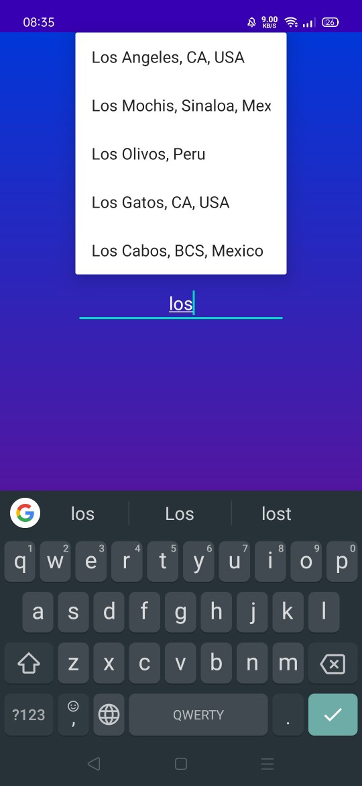
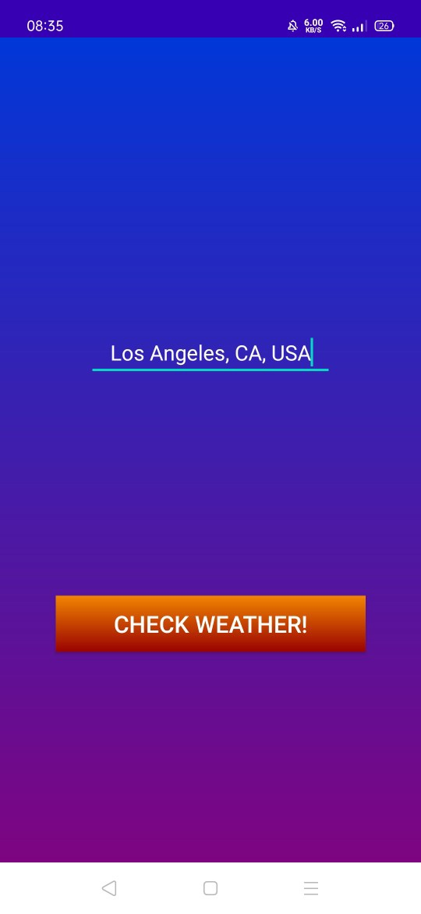
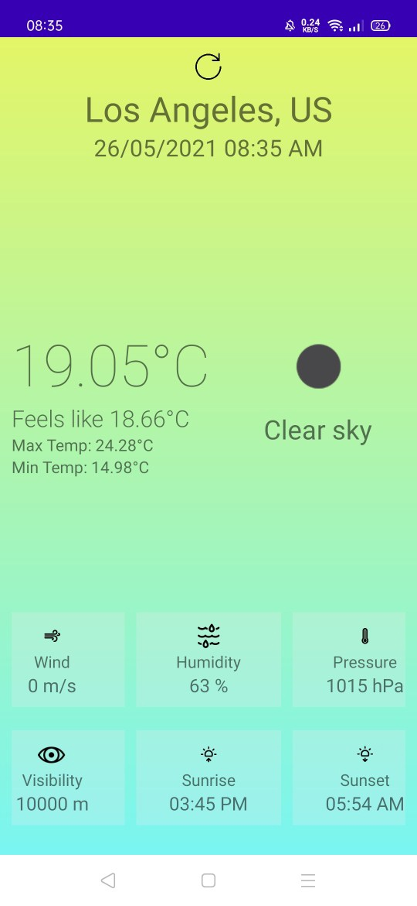
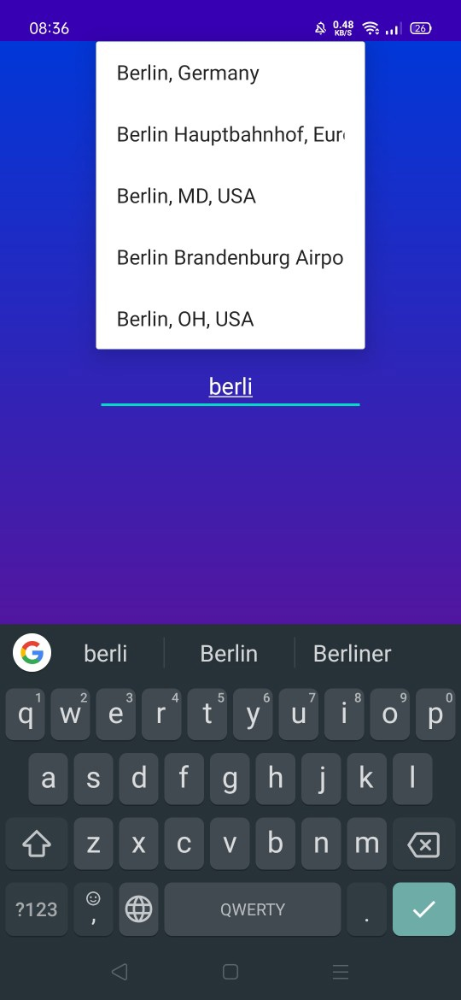
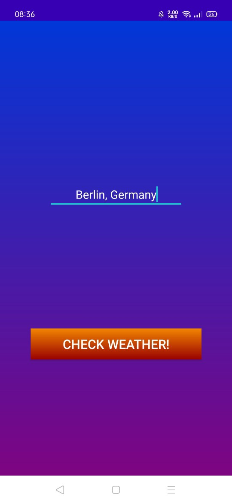
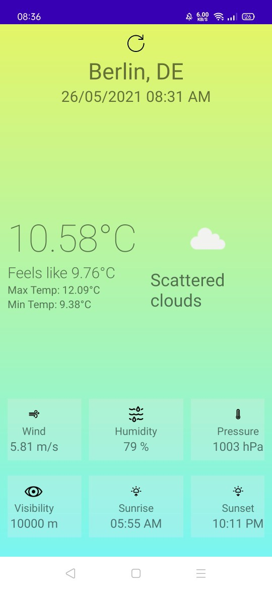

# Weather app

An application that allows you to get the information about the weather almost anywhere in the world.

The app includes two pages:

* Search page
* Weather information page

At the first one you select the desired option and then click the button "Check Weather!" to get the info.

The app has been developed using APIs, so if you want to clone&edit the code, you must connect the appropriate dependencies.

I've used:

* [**Place Autocomplete Google Api**](https://developers.google.com/maps/documentation/places/web-service/autocomplete) for search page.
* [**Current Weather Data API**](https://openweathermap.org/api) for getting the weather information.

## Demonstration of work

### Gif

### Screenies

